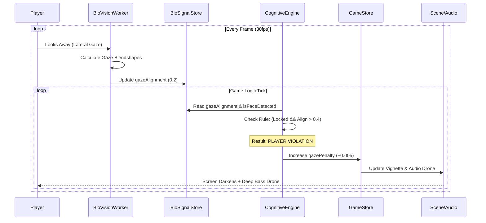

# Panopticon: Bio-Feedback Horror Experience

**Panopticon** is an experimental web-based horror game that adapts to your real-world bio-metrics. Using your webcam and microphone, the game analyzes your fear levels (heart rate, gaze, expression, voice) and adjusts the gameplay, pacing, and scares in real-time.

> **Warning**: This experience requires camera and microphone access. It features flashing lights, loud noises, and psychological horror elements.

## 👁️ Mechanical Core

The system is built on a **"Don't Blink / Don't Look Away"** mechanic.
-   **Face Lock**: You must stare into the void. Looking away, covering your face, or leaving the frame increases the "Gaze Penalty".
-   **Audio Discipline**: Screaming or making loud noises will attract the entity.
-   **Physiological Sync**: The game simulates your heart rate and adrenal response. If you panic, the game becomes more aggressive.

## 🏗️ Architecture

The application follows a Unidirectional Data Flow architecture, centered around the `BioSignalStore` and `GameStore`.

```mermaid
graph TD
    subgraph Input ["Sensory Input"]
        Webcam[Webcam Video]
        Mic[Microphone Audio]
    end

    subgraph Perception ["Perception System"]
        Worker[BioVisionWorker (Web Worker)]
        Analyzer[AudioInputAnalyzer]
        
        Webcam --> Worker
        Mic --> Analyzer
    end

    subgraph State ["State Management (Zustand)"]
        BioStore[BioSignalStore]
        GameStore[GameStore]
        
        Worker -- Landmarks, rPPG, Gaze --> BioStore
        Analyzer -- Volume, Screams --> BioStore
    end

    subgraph Intelligence ["AI Systems"]
        Affect[AffectiveEngine]
        Cognitive[CognitiveEngine]
        
        BioStore -- Metrics --> Affect
        Affect -- Arousal State --> BioStore
        
        BioStore -- Face/Gaze Status --> Cognitive
        Affect -- Arousal --> Cognitive
        Cognitive -- "Actions (Jumpscare, Glitch)" --> GameStore
    end

    subgraph Renderer ["Presentation Layer"]
        Scene[SceneController]
        Canvas[R3F Canvas]
        Audio[AudioManager]
        
        GameStore -- "Game State" --> Scene
        BioStore -- "Bio-Data (HUD)" --> Scene
        
        Scene --> Canvas
        Scene --> Audio
    end
```

### Key Components
1.  **BioVisionWorker**: A dedicated Web Worker running MediaPipe FaceLandmarker. It extracts 478 face landmarks and 52 blendshapes (Gaze, Blink) at 30fps without blocking the main thread.
2.  **AffectiveEngine**: A Sensor Fusion layer that combines Heart Rate (rPPG), Pupil Dilation (Iris estimation), Pallor (Skin color), and Voice Stress into a single `Arousal` metric (0.0 - 1.0).
3.  **CognitiveEngine**: The "Director" AI. It observes the player's state and decides when to trigger events (lights flickering, whispers, jumpscares) to maintain an optimal tension curve (Flow State).

## 🔄 Sequence: Gaze Penalty Loop

This sequence demonstrates how the system enforces eye contact.



## 🛠️ Tech Stack

-   **Frontend**: React, TypeScript, Vite
-   **3D / Graphics**: React Three Fiber (Three.js), React Postprocessing
-   **AI / Vision**: MediaPipe (FaceLandmarker), custom rPPG algorithms
-   **State**: Zustand
-   **Styles**: TailwindCSS

## 🚀 Setup & Run

1.  Clone the repository.
    ```bash
    git clone https://github.com/LJPearson176/horror_marketing.git
    cd horror_marketing
    ```

2.  Install dependencies.
    ```bash
    npm install
    ```

3.  Run development server.
    ```bash
    npm run dev
    ```

4.  Open `http://localhost:5173` and allow Camera/Microphone access.

## 👁️ Technology Spotlight: True Gaze

Panopticon detects not just your face, but your **Eye Vector**. We use MediaPipe's 52-blendshape model to calculate a precise "Gaze Alignment" score.

### The Algorithm
The system extracts 8 key blendshapes from the `FaceLandmarker` result:
-   `eyeLookInLeft` / `eyeLookOutLeft`
-   `eyeLookUpLeft` / `eyeLookDownLeft`
-   (And counterparts for Right Eye)

It calculates a **Deviation Vector** from the center:
```typescript
// Average directional force
const lookLeft = (lookOutLeft + lookInRight) / 2;
const lookRight = (lookInLeft + lookOutRight) / 2;
const deviation = Math.max(lookLeft, lookRight, lookUp, lookDown);
```

This deviation is inverted to create the **Alignment Score** (1.0 = Perfect Eye Contact). If `deviation > 0.4`, the system flags you as **"LOOKING AWAY"** (`State: LEFT/RIGHT/UP/DOWN`), triggering immediate gameplay penalties.

This allows the game to detect if you are:
-   Looking over your shoulder.
-   Checking your phone.
-   Avoiding the monster's eyes.
-   Even if your head is facing forward (Side Eye).

